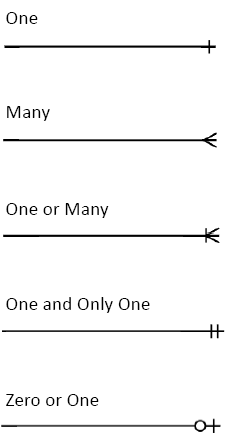
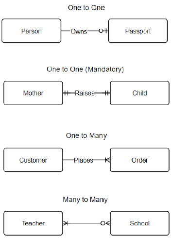

## What is a Conceptual Model?

A conceptual model is a simplified representation of the final database. The focus is on the broad picture, and specifics are removed.

### Key Features of a Conceptual Model

- Define business needs
- Establish vocabulary
- Foster communication
- Build a plan for favorable outcomes

### Steps to Build a Conceptual Model

1. Identify business objects
2. Establish relationships between objects
3. Determine cardinality
4. Name the relationship
5. Repeat as necessary

---

## What is a Conceptual Model Entity?

- Loosely speaking, you can think of model entities as database tables.
- Think of them as "nouns."
- They are the starting point for our database table design.

---

## Cardinality and Crow's Foot Notation

### Cardinality Types:

### Example Relationships:

---

### What are entity Relationship diagrams?

Entity Relationship Diagrams, or ER Diagrams, visualize the relationship between entities within a database.
It is a design or blueprint of the database.

---

### When do we use ER Diagram?

Design a new database
- Break down problem into smaller steps.
- Help see relationships.
- Debug a database.
- Graphically represent database structure.
---
### What is Database Normalization?
- Table should be about specific topic.
- Only columns supporting that topic are included.

### Reasons for Database Normalization.
- Minimize duplicate data.
- Minimize or avoid data modification issues.
- Simplify queries.

### Definition of Database Normalization
- There are three common forms of database normalization: 1st, 2nd, and 3rd normal forms.

The forms are progressive. Meaning that to qualify for 3rd normal form a table must first satisfy the rules for 2nd normal form, and 2nd normal form must adhere to those for 1st normal form.

The First Normal Form.
- The information is stored in relational table and each column contains atomic values, and there are not repeating groups of columns.

The Second Normal Form.
- The table is in first normal form and all the columns depend on the table's primary key.

The Third Normal Form.
- Third Normal Form - the table is in second normal form and all of its columns are not transitively dependent on the primary key.

---
### First Normal Definition
- Data is in a relational database table:
  - Rows
  - Columns
  - Primary Key
-Each column contains Atomic Values.
---
### The Second Normal Form
- All Tables are in the 1st Normal Form.
- All the non-key columns are dependent on the table's primary key.

Ask yourself: What is the table's purpose?
Does this column serve to describe the primary key identifiers?

